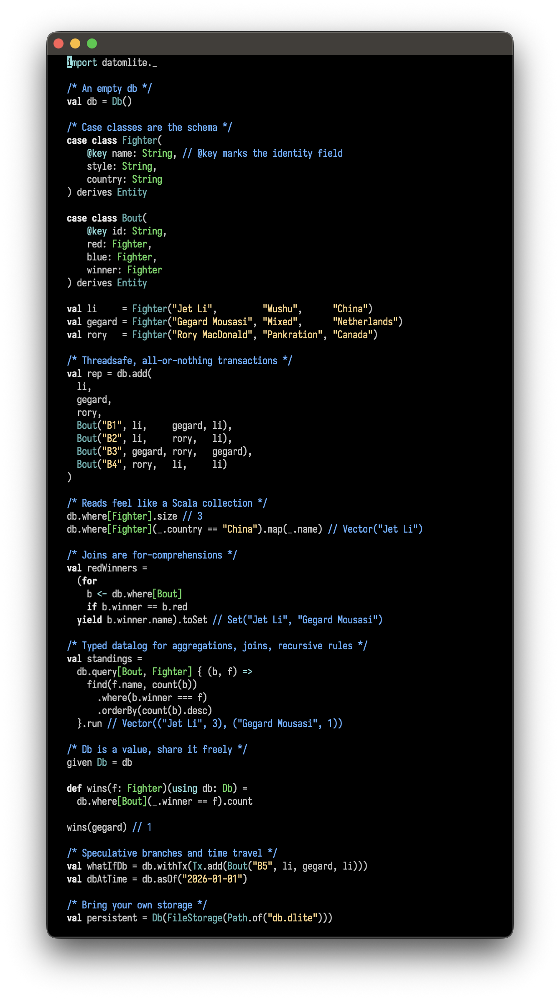
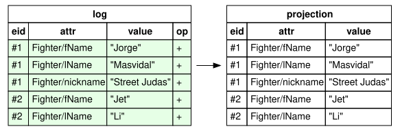
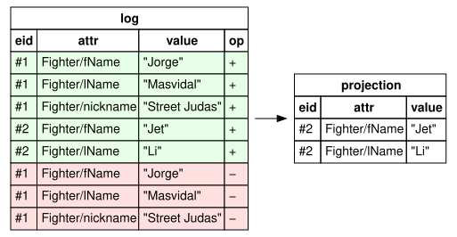
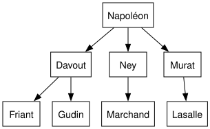
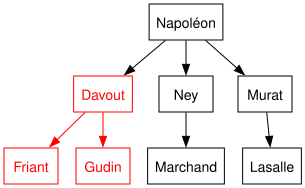
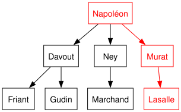
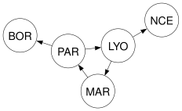
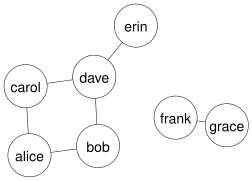
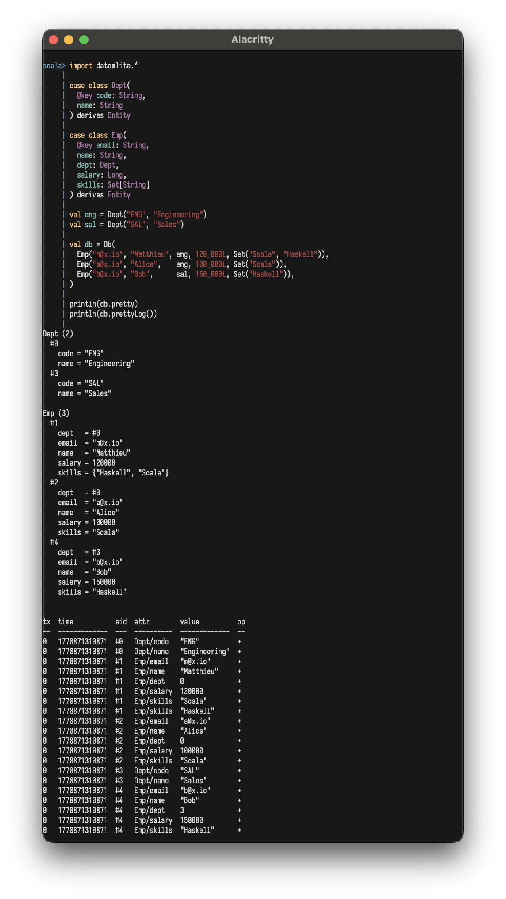

<div align="right">
  <sub><em>part of <a href="https://github.com/mattlianje/d4"></a> <a href="https://github.com/mattlianje/d4">d4</a></em></sub>
</div>

<p align="center">
  
</p>

#  datomlite

**Lightweight, immutable database**

**datomlite** is a zero-dep "DB-as-a-value" you can drop into your Scala 3 apps

- Zero deps, pure Scala 3.7+
- Cross-platform (JVM, JS, Native)
- Case classes are "the schema" (no EDN, no DDL)
- Append-only log: every past state stays queryable
- Typed queries, compile-time checked
- Datalog joins, refs, aggregations, window functions, recursive rules
- Easy time-travel and speculative transactions
- Named-tuple query results
- Implement `Storage` and bring your own backend

```scala
"xyz.matthieucourt" %% "datomlite" % "0.1.0"
```

All you need:
```scala
import datomlite._
```

Try it in your REPL:
```
 scala-cli repl --dep xyz.matthieucourt::datomlite:latest.release
```

## Contents
- [Quick start](#quick-start)
- [FAQ](#faq)
- [Updates](#updates)
- [Example schema](#example-schema)
- [Operations](#operations)
- [Keys and uniqueness](#keys-and-uniqueness)
- [Refs and cardinality](#refs-and-cardinality)
- [Optional fields](#optional-fields)
- [Tx blocks](#tx-blocks-batch-multiple-ops)
- [Listen](#listen-for-db-changes)
- [Predicates](#predicates-as-index-probes)
- [Queries](#queries)
  - [For-comprehension joins](#for-comprehension-joins)
  - [Typed queries](#typed-queries)
  - [Named-tuple rows](#named-tuple-rows)
  - [Aggregations](#aggregations)
  - [Sort and paging](#sort-and-paging)
- [Pull](#pull-to-shape-query-results)
  - [Reverse refs](#reverse-refs)
- [Time travel](#time-travel-through-past-states)
- [History](#history-of-every-entity)
- [Diff](#diff-two-databases)
- [Negation](#negation-as-anti-join)
- [Existential subgoals](#existential-subgoals-semi-joins)
- [Window functions](#window-functions)
- [Rules](#rules)
  - [Self-ref closure (`Rule.reaches`)](#self-ref-closure-rulereaches)
  - [Multi-body rules (`Rule[A, B]`)](#multi-body-rules-rulea-b)
  - [Recursive rules (`Rule.recursive`)](#recursive-rules-rulerecursive)
- [Persistence](#persistence-and-custom-backends)
- [Sharing the db](#sharing-the-db-across-threads)
- [Debug](#debug-pretty-print-state-and-log)
- [Build / Contribute](#build--contribute)

## Quick start
The whole surface, in one snippet:

```scala
import datomlite._

/* Just derive `Entity` on your case classes */
case class Person(@key email: String, name: String) derives Entity

/* Create an empty db */
val db = Db()

/* Easy, threadsafe transactions */
db.add(Person("m@x.io", "Matt"), Person("a@x.io", "Alice"))

/* Your db feels like a collection */
db.where[Person].run
db.where[Person](_.email == "m@x.io").one

db.upsert(Person("m@x.io", "Matthieu"))

/* Typed Datalog: joins, projections, aggs */
db.query[Person] { p =>                        
  find(p.name) where (p.email === "m@x.io")
}.run

db.retractWhere[Person](_.email == "m@x.io")
```

## FAQ

**Why datomlite?**<br>
First, for good-spirited fun and happy hacking. Second, I have long wanted a datastore "as-a-value" I can drop into my processes and throw my case classes
at, without first carving EDN, registering attributes, or learning a finicky ersatz Datalog DSL.

**What is it under the hood?**<br>
Essentially, datomlite is a bunch of macro based niceties on top of an append-only log of `(eid, attr, value)` triples plus in-memory indices over the live
projection. Your case classes are shredded into triples on write and reassembled on read,
so queries feel like working with your original typed objects.

**What indices does it maintain?**<br>
**EAVT** for live entity reads, **AVET** for value lookups, and a **class index** to enumerate entities of a Scala type. All are derived from the append-only log and updated in lockstep with each commit.

**Does it support all of Datalog?**<br>
No. Recursion goes through named rules, negation is top-level conjunctions only, and there is no built-in unification beyond the DSL.

**Differences from Datomic / Datascript?**<br>
- Case classes are "the schema". There is no `:db/ident`, no attribute registration or otherwise separate cardinality/uniqueness facts.
- Queries are typed Scala, not vectors of triples. Field access is compile-checked by the datomlite macros.
- Single-process, single-writer. No peer/transactor, no client API

**Transaction guarantees?**<br>
- **Atomicity.** All asserts and retracts in a tx commit together or none do. A `UniqueViolation` or any thrown exception inside a tx block aborts the whole thing with no partial state.
- **Linearizable commits.** Each commit goes through a CAS on the live state.
- **Snapshot reads.** Every read call (`where`, `query`, `pull`, `byEid`) dereferences the live state once at entry and operates on that immutable snapshot for its duration.
- **Optimistic multi-writers.** Many threads can call `transact` concurrently. CAS losers rebuild against the new state and retry. In effect, there is no write lock or single-writer requirement.

**What is the inspiration?**<br>
Although **datomlite** borrows ideas from [Datomic](https://www.datomic.com/), [Datascript](https://github.com/tonsky/datascript), [Mentat](https://github.com/mozilla/mentat) and [XTDB](https://xtdb.com/) and is in the general orbit of Datalog flavoured triple stores, it puts particular (and to my knowledge novel) emphasis on type-safety and feeling 100% embedded into the host language. 

In a sense, **datomlite** is "DB-as-a-value", but does not preoccupy itself with functional purity per se.

## Updates
Suppose we add two pugilists to our database, "Jet Li" and "Masvidal". Adding them appends datoms and the live projection picks them up:

```scala
import datomlite._

case class Fighter(
  fName: String,
  lName: String,
  nickname: Option[String]
) derives Entity

val db = Db(
  Fighter("Jorge", "Masvidal", Some("Street Judas")),
  Fighter("Jet",   "Li",       None),
)
```

<p align="center">
  
</p>

Unsurprisingly, we want to remove Masvidal:
```scala
db.retractWhere[Fighter](_.lName == "Masvidal")
db.where[Fighter].run
// Vector(Fighter("Jet", "Li", None))
```
The live projection drops Masvi, but the log still has every datom.

<p align="center">
  
</p>

## Example schema
We'll use these vanilla domain entities throughout for example purposes...

```scala
case class Department(@key code: String, name: String) derives Entity
case class Skill(@key name: String) derives Entity
case class Order(buyer: String, item: String, price: Long) derives Entity

case class Employee(
  @key email: String,
  name: String,
  dept: Department,
  salary: Long,
  skills: Set[Skill] = Set.empty,
  nickname: Option[String] = None
) derives Entity
```

## Operations
Writes commit all-or-nothing and return a `TxReport`. 
Reads capture one snapshot at entry.

Write:
```
db.add(values*)              assert one or more rows in one tx
db.retract(values*)          retract by full equality, misses are silent
db.retractWhere[A](pred)     find every match and retract in one tx
```

Read:
```
db.where[A]                  Query[A] over all rows of A
db.where[A](pred)            Query[A] filtered, indexed equality lowers to a probe
db.exists[A](pred)           Boolean, short-circuits
db.count[A](pred)            Long, no row materialization
.run / .one                  materialize to Vector / Option
```

```scala
val eng = Department("ENG", "Engineering")

/* Adding */
db.add(Employee("a@x.io", "Alice", eng, 100_000L))
db.add(
  Employee("b@x.io", "Bob",   eng, 120_000L),
  Employee("c@x.io", "Carol", eng, 150_000L),
)

/* Lookups */
db.where[Employee].run                            // Vector[Employee]
db.where[Employee](_.email == "m@x.io").one       // Option[Employee]
db.where[Employee](_.name.startsWith("M")).run    // Vector[Employee]

/* Retract */
db.retractWhere[Employee](_.email == "a@x.io")
db.retractWhere[Employee](_.email == "b@x.io")

/* Quick checks */
db.exists[Employee](_.email == "m@x.io")        // Boolean
db.count[Employee](_.name.startsWith("M"))      // Long
db.count[Employee]                              // Long
```


`Query[A]` is the lazy `Iterable[A]` that `db.where[A]` returns. You materialize it with `.run` (`toVector`) or `.one` (`headOption`).

```scala
db.where[Employee].toList
db.where[Employee].size
db.where[Employee].head
for e <- db.where[Employee] do println(e.name)
```

Each `add`/`retract` returns a `TxReport` with `tx` id and wall-clock `time`. Both feed `asOf` (see [Time travel](#time-travel)).

## Keys and uniqueness
Often, we want to enforce uniqueness of data in our datastore. This this end, **datomlite** lets you mark uniqueness keys:
```
@key                   identity field
@unique                must be unique across the entity
db.upsert(values*)     find by key, retract prior, re-assert under same eid
.key(f)                chained, computed or composite key
.unique(f)             chained, additional unique field
.named("...")          chained, override the attribute prefix
```

Duplicate `@key` or `@unique` raises a `UniqueViolation` and aborts the tx.

```scala
case class User(
  @key email: String,
  @unique handle: String,
  name: String
) derives Entity

db.add(User("a@x.io", "shared", "Alice"))
db.add(User("b@x.io", "shared", "Bob"))
// UniqueViolation: 'shared' is taken
```

> [!NOTE]  
> Write your own `Entity.derived` given instances like below to create custom and/or composite
> uniqueness keys
> 
```scala
case class Friend(a: Person, b: Person)
given Entity[Friend] = Entity.derived[Friend].key { f =>
  val Seq(x, y) = Seq(f.a.email, f.b.email).sorted
  (x, y)
}
```

Same simple name across packages collides on the prefix, override with `.named`:
```scala
given Entity[a.Person] = Entity.derived[a.Person].named("a.Person").key(_.email)
given Entity[b.Person] = Entity.derived[b.Person].named("b.Person").key(_.email)
```

## Refs and cardinality
Currently in datomlite, cardinality is a property of the Scala type, not a separate declaration (which might be a bit controversial)

```
T          one datom per row
Option[T]  one datom on Some, nothing on None
Set[T]     one datom per element
R          one datom, value is the target eid (needs Entity[R] in scope, target needs @key)
Set[R]     one datom per target eid
```

`===` joins across refs, card-one or card-many.

```scala
db.query[Employee, Department, Skill] { (e, d, s) =>
  find(e.email, s.name) where (
    e.dept === d &&
      d.name === "Engineering" &&
      e.skills === s
  )
}.run // Vector(("m@x.io","Scala"), ("m@x.io","Haskell"), ("a@x.io","Scala"))
```

## Optional fields
For **datomlite** entities `Option[T]` writes a datom only on `Some`. `None` is absence, not a stored null.

```scala
val eng = Department("ENG", "Engineering")

val db = Db(
  Employee("m@x.io", "Matthieu", eng, 120_000L, nickname = Some("Matt")),
  Employee("a@x.io", "Alice",    eng, 110_000L),
)

db.where[Employee](_.nickname.contains("Matt")).run.map(_.email) // Vector("m@x.io")

db.where[Employee](_.nickname == None).run.map(_.email) // Vector("a@x.io")
```

In a typed query, `find(e.nickname)` projects the inner type, emits a row only when present.

```scala
db.query[Employee] { e =>
  find(e.email, e.nickname)
}.run
// Vector(("m@x.io", "Matt"))
```

## Tx blocks: batch multiple ops
You'll often want to batch transaction that are to run sequentially, and **datomlite** supports this
```
db.tx { b => ... }            mixed add/retract/upsert in one tx
b.add / b.retract / b.upsert  inside the block
b.retractWhere[A](pred)       finds matches, appends a retract
b.upsertWhere[A](pred)(f)     reads matches, applies f, appends an upsert
db.retractWhere / db.upsertWhere(pred)(f)   one-shot tx versions
Tx.batch(steps*)              hold steps as a value
db.transact(tx)               apply a Tx value
```

Steps run in order against state-so-far, share one tx id, all-or-nothing.

```scala
db.tx { b =>
  b.upsertWhere[Employee](_.email == "m@x.io")(_.copy(name = "Matthieu"))
  b.add(Order("m@x.io", "book", 20L))
}
```

`retractWhere` / `upsertWhere` inside the block:
```scala
db.tx { b =>
  b.retractWhere[Order](_.buyer == "ghost@x.io")
  b.upsertWhere[Employee](_.email == "m@x.io")(_.copy(salary = 130_000L))
}
```

You can also postpone a transaction and run it later as below:
```scala
val tx = Tx.batch(
  Tx.add(Order("m@x.io", "book", 20L)),
  Tx.add(Order("m@x.io", "pen",   5L)),
)
db.transact(tx)
```

From a transaction you'll get back `TxReport`
this carries 
```
tx, time, adds, retracts, addedEids
```

## Listen for db changes
You often want to respond to changes made to your datastore, which is why datomlite has `.listen`.

The callback fires after each successful commit with the `TxReport` (tx id, adds, retracts, addedEids). Reads inside see the just-committed state. Use it for cache invalidation, outbox pushes, WebSocket fan-out, audit logs, or any side effect that should trail a write.

```scala
db.listen { rep =>
  println(s"tx ${rep.tx.value}: +${rep.adds.size} -${rep.retracts.size}")
}
```
> [!NOTE]  
> Snapshots and `withTx` branches (see [Time travel](#time-travel)) are read-only, `listen` is a no-op


## Predicates as index probes
You will have noticed datomlite operations with predicate feel like operations on plain collections.

Under the hood, when you use predicates, **datomlite**'s macros lift plain equality to index-probed queries (so you aren't scanning all your triples)

```scala
db.where[Employee](_.email == "m@x.io").run // <-- index probe
db.where[Employee](_.name.startsWith("M")).run // <-- slow scan
```

> [!NOTE]
> Only equality lowers to a probe. `startsWith`, `>`, regex etc. all become full scans.

Notably (and powerfully), Ref fields are walked inline, even when nested:
```scala
db.where[Employee](_.email == "m@x.io").one.get.dept.name
db.where[Employee](_.dept.name == "Engineering").run // <-- two hop index probe
db.where[Employee](_.dept == Department("ENG", "Engineering")).run
```

Card-many value fields support `.contains` as an index probe:
```scala
case class Tagged(
  @key name: String,
  tags: Set[String]
) derives Entity

val tdb = Db(
  Tagged("matt", Set("fp", "scala")),
  Tagged("ali",  Set("ml")),
)

tdb.where[Tagged](_.tags.contains("fp")).run.map(_.name) // Vector("matt")
```

## Queries
For querying, you have two surfaces: (1/2) for-comprehensions over `where` for plain stitching on a shared scalar, and (2/2) `db.query[...]` for projections, joins, aggregations, windows, and rules with compile-time field checks.

### For-comprehension joins
Stitch `where[A]` results together with normal Scala for-comprehensions, no DSL.

```scala
db.add(Order("m@x.io", "book", 20L), Order("a@x.io", "lamp", 90L))

(for
  e <- db.where[Employee]
  o <- db.where[Order](_.buyer == e.email)
yield (e.name, o.item)).run
// Vector(("Matt", "book"), ("Alice", "lamp"))
```

> [!NOTE]
> Every join here is a nested loop. Reach for `db.query[...]` once you need projections, multi-entity joins, or indexed equality.

### Typed queries
The full surface: projections, multi-entity joins, aggregations, windows, rules. Each type parameter binds a row, `find(...)` projects, `where(...)` constrains. Combine with `&&` / `||`, compare with `===`, `!==`, `>`, `<`, `>=`, `<=`. Field access is compile-checked, `where` is optional.

```scala
db.query[Employee] { e =>
  find(e.name) where (e.email === "m@x.io")
}.run
// Vector("Matt")

db.query[Employee] { e =>
  find(e.name)
}.run
// Vector("Matt", "Alice", "Bob")
```

`||` distributes over `&&`. Disjuncts run as separate passes, call `.distinct` for set semantics.

```scala
db.query[Employee] { e =>
  find(e.name) where (e.email === "m@x.io" || e.email === "b@x.io")
}.run
// Vector("Matt", "Bob")
```

Joins on a ref use `===`, on a shared scalar use field equality:

```scala
db.query[Employee, Department] { (e, d) =>
  find(e.email, d.name) where (
    e.dept === d &&
      d.name === "Engineering"
  )
}.run
// Vector(("m@x.io","Engineering"), ("a@x.io","Engineering"))

db.query[Employee, Order] { (e, o) =>
  find(e.name, o.item) where (
    e.email === o.buyer && o.price > 50L
  )
}.run
// Vector(("Alice","lamp"), ("Bob","chair"))
```

Typos list available fields at compile time which is nice:
```scala
db.query[Employee] { e => find(e.emial) where (e.email === "x") }
does not compile: `emial` is not a field of Employee. Available: email, name, dept, salary
```

Reusable constraints are functions returning `Constraint`:
```scala
def engineers(d: Row[Department]): Constraint = d.name === "Engineering"
def expensive(e: Row[Employee], min: Long): Constraint = e.salary > min

db.query[Employee, Department] { (e, d) =>
  find(e.email) where (
    engineers(d) && expensive(e, 100_000L) && e.dept === d
  )
}.run
```

### Named-tuple rows
Pass named args to `find(...)` and the row is a `NamedTuple` with those exact labels and types.

```scala
val rows = db.query[Employee, Department] { (e, d) =>
  find(name = e.name, dept = d.name, salary = e.salary)
    .where(e.dept === d)
    .orderBy(e.salary.desc)
}.run
// Vector[NamedTuple[("name","dept","salary"), (String, String, Long)]]

rows.head.name             // "Bob"
rows.map(_.salary).sum     // 270000L
```

```scala
for case (name = n, salary = s) <- rows if s > 100_000L
yield s"$n earns $s"
```

### Aggregations
**datomlite** comes with built-in "sugar" for `groupBy` + fold over the query rows. Aggregator terms (`count`, `sum`, `avg`, `min`, `max`) sit inside `find(...)`, bare `find` vars become the group keys (no `GROUP BY`), wrong types are compile errors.

```
count(t) / countDistinct(t)        Long
sum(t) / avg(t)                    Numeric[T]
min(t) / max(t)                    Ordering[T]
```

```scala
db.query[Employee, Order] { (e, o) =>
  find(e.name, sum(o.price)) where (e.email === o.buyer)
}.run
// Vector(("Matt",20), ("Alice",90), ("Bob",60))
```

For one-entity rollups, stay in Scala:

```
Query[A].groupBy(f)       Map[K, Vector[A]] with .agg extension
Query[A].countBy(f)       Map[K, Long]
```

```scala
db.add(
  Order("m@x.io", "book", 20L),
  Order("m@x.io", "pen",   5L),
  Order("a@x.io", "lamp", 90L),
)

db.where[Order].groupBy(_.buyer).agg(_.map(_.price).sum)
// Map("m@x.io" -> 25, "a@x.io" -> 90)

db.where[Order].countBy(_.buyer)
// Map("m@x.io" -> 2, "a@x.io" -> 1)
```

### Sort and paging
Order and slice on the `Query` itself, no need to `.run` then `sortBy` in Scala.

```
.orderBy(term.asc | term.desc, ...)   typed query, sort keys must be in find(...)
.orderBy(f) / .orderByDesc(f)         where[A] surface, by selector
.limit(n) / .offset(n)
```

```scala
db.query[Employee] { e =>
  find(e.name, e.salary)
    .where(e.salary > 100_000L)
    .orderBy(e.salary.desc)
    .limit(2)
}.run
// Vector(("Bob",150000), ("Matt",120000))

db.where[Employee].orderBy(_.salary).limit(2).run
db.where[Order].orderByDesc(_.price).offset(10).limit(10).run
```

## Pull to shape query results
Pull is for *shaping* results. The closure picks the fields you want and walks refs to pull sub-shapes, all against a single snapshot. 

This is especially handy when you want a nested output without writing a join, or to skip materializing heavy entities just to read a few fields.

```
.pull(f) / .pullOne(f)    project rows through Pull[A]
db.byEid[A](eid)          reconstruct an entity from a raw eid
db.pullByEid[A](eid)(f)   pull by raw eid
p.field                   read a single attribute
p.refField(sub)           nested pull through a card-1 ref
p.value                   reconstruct the whole entity
p.reverse[E](_.field)     walk a ref backwards, MultiPull[E]
```

```scala
db.where[Employee](_.email == "m@x.io").pullOne(_.dept(_.name))
// Some("Engineering")

db.where[Employee](_.dept.name == "Engineering").pull(e => (e.email, e.name))
// Vector(("m@x.io", "Matt"), ("a@x.io", "Alice"))
```

By eid (from `TxReport.addedEids` or the log):

```scala
val rep = db.add(Employee("m@x.io", "Matt", Department("ENG", "Engineering"), 120_000L))
val eid = rep.addedEids.head

db.byEid[Employee](eid)
// Some(Employee(...))

db.pullByEid[Employee](eid)(e => (e.name, e.dept(_.name)))
// Some(("Matt", "Engineering"))
```

Both return `None` for missing or wrong-type eids.

### Reverse refs
Walks a ref backwards from `p` to every `E` pointing at `p`. Card-one or card-many.

```scala
db.where[Department](_.code == "ENG")
  .pullOne(d => d.reverse[Employee](_.dept).map(_.name))
// Some(Vector("Matt", "Alice"))
```

Nests inside larger pull trees:

```scala
db.where[Department](_.code == "ENG").pullOne { d =>
  (d.name, d.reverse[Employee](_.dept).map(e => (e.name, e.skills.map(_.name))))
}
// Some((
//   "Engineering",
//   Vector(
//     ("Matt",  Vector("Scala", "Haskell")),
//     ("Alice", Vector("Scala")),
//   ),
// ))
```

Without `reverse`, a flat query plus regrouping pass is needed, and anyone with empty skills drops to the inner join:

```scala
val triples = db.query[Department, Employee, Skill] { (d, e, s) =>
  find(e.name, s.name) where (d.code === "ENG" && e.dept === d && e.skills === s)
}.run
// Vector(("Matt", "Scala"), ("Matt", "Haskell"), ("Alice", "Scala"))
```

## Time travel through past states
datomlite lets you (for a given "current" DB), read any past state or branch off a speculative transaction.

In both cases the live `Db` remains untouched

```
db.asOf(tx)               rewind to a tx id
db.asOf(time)             rewind to a Time
db.asOf("2026-01-15")     takes any ISO-8601
db.snapshot               freeze current state
db.withTx(tx)             speculative branch
```

```scala
val rep1 = db.add(Employee("c@x.io", "Carol", Department("ENG", "Engineering")))
val rep2 = db.add(Employee("d@x.io", "Dan",   Department("ENG", "Engineering")))

db.where[Employee].count                    // 5
db.asOf(rep1.tx).where[Employee].count      // 4, before Dan
db.asOf(rep2.time).where[Employee].count    // 5, by wall-clock
```

ISO-8601 strings accept `Z` or `±HH:MM`, default UTC:

```scala
db.asOf("2026-01-15").where[Employee].count             // by date
db.asOf("2026-01-15T10:30:00Z").where[Employee].count   // by instant
```

Snapshot vs what-if:
```scala
val snap   = db.snapshot
val whatIf = db.withTx(Tx.add(Employee("e@x.io", "Eve",
                                       Department("ENG", "Engineering"))))

snap.where[Employee].count        // 5, unchanged
whatIf.where[Employee].count      // 6, includes Eve
db.where[Employee].count          // 5, live untouched
```

## History of every entity
You can call `.log` on any datomlite to get the full history of triples... or `.history`/`.historyOf` to get the history of
specific entities.

```
db.log                    every datom in tx order
db.historyOf(a)           trail for the entity currently matching a
db.history(eid)           trail for an eid, survives retraction
```

Each datom carries `tx`, `time`, `Op.Assert | Op.Retract` and nothing is overwritten.

```scala
val eng = Department("ENG", "Engineering")

val rep1 = db.add(Employee("m@x.io", "Matt", eng, 120_000L))
val rep2 = db.upsert(Employee("m@x.io", "Matthieu", eng, 130_000L, nickname = Some("Matt")))
db.retractWhere[Employee](_.email == "m@x.io")

db.log
// every Datom across every tx, with (eid, attr, value, tx, time, op)

db.historyOf(Employee("m@x.io", "Matthieu", eng, 130_000L, nickname = Some("Matt")))
// empty, no live entity matches

db.history(rep1.addedEids.head)
// full assert/retract trail for that eid
```

## Diff two databases
When your database is a value, you can do fun things like diff it against another database, or the same database
with some speculative transactions that have been applied to it.

`a.diff(b)` returns `DbDiff(added, retracted)` over the live `(eid, attr, value)` triples. Composes with `snapshot`, `withTx`, `asOf` from the same lineage (see [Time travel](#time-travel)).

```scala
val before = db.snapshot
db.upsertWhere[Employee](_.email == "m@x.io")(_.copy(name = "Matthieu"))

val d = before.diff(db)
d.added.map(_.v)        // Vector("Matthieu")
d.retracted.map(_.v)    // Vector("Matt")
```

Pairs with `withTx` for what-if:

```scala
val eng = Department("ENG", "Engineering")
val whatIf = db.withTx(Tx.add(Employee("e@x.io", "Eve", eng, 100_000L)))
db.diff(whatIf).added   // datoms Eve would add
```

## Negation as anti-join
With **datomlite** `not(c)` is the "anti-join". A row passes if and only if substituting it into the negated subgoal produces no matches.

```scala
/* employees with no orders */
db.query[Employee, Order] { (e, o) =>
  find(e.name) where not(e.email === o.buyer)
}.run
```

`not(...)` only sits in the top-level conjunction. No `||`, no `not(not(...))`. Every variable inside `not` must be scoped by the outer positive part (Datalog-safe negation).

## Existential subgoals (semi-joins)

You often ask yourself: "does at least one such row exist?", but don't want to bring the matched
row into your output like in a semi-join.

To this end **datomlite** queries can have `exists[A] { row => ... }` binds a fresh row scoped to the constraint body, without projecting it. Reads as "some `A` exists such that the body holds".

```scala
/* orders whose buyer exists as a registered Employee */
db.query[Order] { o =>
  find(o.item) where exists[Employee] { e => e.email === o.buyer }
}.run
```

## Window functions
Like with aggregations, datomlite's window functions are just sugar on top of datalog so
you don't have to hand-roll such windowing on Scala vectors.

```scala
db.query[Employee, Department] { (e, d) =>
  find(
    d.name,
    e.name,
    e.salary,
    rank()           over partitionBy(d).orderBy(e.salary.desc),
    sum(e.salary)    over partitionBy(d)
  ).where(e.dept === d)
}.run
```

Available functions:
```
rowNumber()                          Long,        1-indexed, needs orderBy
rank()                               Long,        ties share rank, next rank skips
denseRank()                          Long,        ties share rank, next rank does not skip
lag(t, n = 1) / lead(t, n = 1)       Option[T],   None past partition edge
sum/min/max/avg/count(t).over(spec)  input type,  broadcast over the partition
```

```scala
db.query[Employee, Department] { (e, d) =>
  find(d.name, e.name, rowNumber() over partitionBy(d).orderBy(e.salary.desc))
    .where(e.dept === d)
    .orderBy(d.name.asc)
}.run.filter(_._3 == 1L) // top earner per dept
```


## Rules
A `Rule[A, B]` is a named, reusable predicate between two rows, callable inside any `where(...)` as if you'd inlined its body.

Multiple bodies act as Datalog disjunction (any one holds).

Recursive rules (body references `self`) evaluate to a fixed point.

```
Rule.reaches[A](_.field)              transitive closure of one self-ref field
Rule[A, B](bodies*)                   multi-body Datalog without recursion
Rule.recursive[A, B] { self => ... }  recursive Datalog, naive fixed-point
rule(src, dst)                        call inside any where(...)
```

### Self-ref closure (`Rule.reaches`)
"All entities reachable from `src` along one ref field". Walks the AVET edge directly, no fixed-point.

```scala
case class Node(
  @key id: String,
  children: Set[Node]
) derives Entity

val db = Db()
val d = Node("d", Set.empty)
val c = Node("c", Set(d))
val a = Node("a", Set(c))
val b = Node("b", Set.empty)
db.add(Node("root", Set(a, b)))

val reachable: Rule[Node, Node] = Rule.reaches[Node](_.children)

db.query[Node, Node] { (s, t) =>
  find(t.id) where (s.id === "root" && reachable(s, t))
}.run.toSet
// Set("a", "b", "c", "d")
```

Either side can be bound. With `t.id === "d"` you get every ancestor of `d`. With both unbound, every reachable pair. The field must be a self-ref (`A` or `Set[A]`), a typo or non-ref field is a compile error.

### Multi-body rules (`Rule[A, B]`)
Each body is a constraint over the head row params. Multiple bodies act as Datalog disjunction: a pair satisfies the rule if any one body holds.

```scala
case class User(@key email: String, role: String) derives Entity
case class Doc(@key slug: String, owner: String, public: Boolean) derives Entity

val canRead: Rule[User, Doc] = Rule[User, Doc](
  (u, d) => d.owner === u.email,
  (u, d) => d.public === true,
  (u, d) => u.role === "admin"
)

db.query[User, Doc] { (u, d) =>
  find(u.email, d.slug) where canRead(u, d)
}.run
```

Same call shape as a recursive rule, no `self` parameter.

### Recursive rules (`Rule.recursive`)
The closure receives the rule itself, so a body can call back into it for the recursive case. Evaluation is fixed-point and always terminates over the finite fact domain.

Let's imagine we have a hierarchy of officers...
<p align="center">
  
</p>

```scala
case class Off(
  @key name: String,
  boss: Option[String]
) derives Entity

val db = Db()
db.add(Off("Napoléon", None))
db.add(Off("Davout",   Some("Napoléon")))
db.add(Off("Ney",      Some("Napoléon")))
db.add(Off("Murat",    Some("Napoléon")))
db.add(Off("Friant",   Some("Davout")))
db.add(Off("Gudin",    Some("Davout")))
db.add(Off("Lasalle",  Some("Murat")))
db.add(Off("Marchand", Some("Ney")))

val ancestor: Rule[Off, Off] =
  Rule.recursive[Off, Off] { self =>
    Seq(
      (anc, desc) => desc.boss === anc.name,
      (anc, desc) => exists[Off] { mid =>
        desc.boss === mid.name && self(anc, mid)
      }
    )
  }
```

**Subordinates of "Davout":**
<p align="center">
  
</p>

```scala
db.query[Off, Off] { (anc, desc) =>
  find(desc.name) where (anc.name === "Davout" && ancestor(anc, desc))
}.run.toSet
// Set("Friant", "Gudin")
```

**"Lasalle"'s reporting line:**
<p align="center">
  
</p>

```scala
db.query[Off, Off] { (anc, desc) =>
  find(anc.name) where (desc.name === "Lasalle" && ancestor(anc, desc))
}.run.toSet
// Set("Murat", "Napoléon")
```

In SQL: recursive CTE.

```sql
WITH RECURSIVE ancestor(anc, desc) AS (
  SELECT boss, name FROM off WHERE boss IS NOT NULL
  UNION
  SELECT a.anc, o.name
  FROM ancestor a JOIN off o ON o.boss = a.desc
)
SELECT desc FROM ancestor WHERE anc = 'Napoleon';
```

#### Directed graph (Roads)

<p align="center">
  
</p>

```scala
case class Place(@key code: String) derives Entity

case class Road(
  from: Place,
  to: Place
)
given Entity[Road] = Entity.derived[Road].key(r => (r.from.code, r.to.code))

val db = Db()
Seq("PAR", "LYO", "MAR", "NCE", "BOR").foreach(c => db.add(Place(c)))

def road(a: String, b: String): Unit =
  db.add(Road(Place(a), Place(b)))

road("PAR", "LYO")
road("LYO", "MAR")
road("MAR", "PAR")   // cycle
road("LYO", "NCE")
road("PAR", "BOR")

val reachable: Rule[Place, Place] =
  Rule.recursive[Place, Place] { self =>
    Seq(
      (s, t) => exists[Road] { r => r.from === s && r.to === t },
      (s, t) => exists[Place] { mid =>
        exists[Road] { r => r.from === s && r.to === mid } && self(mid, t)
      }
    )
  }

/* Everywhere reachable from Paris. The cycle means PAR reaches itself */
db.query[Place, Place] { (s, t) =>
  find(t.code) where (s.code === "PAR" && reachable(s, t))
}.run.toSet
// Set("LYO", "MAR", "PAR", "NCE", "BOR")
```

#### Undirected graph (Friends)
Sort endpoints in the key so `Friend(a, b)` == `Friend(b, a)`. `knows` is two bodies (one per orientation), `connected` is the closure. Seven people, six edges, two components:

<p align="center">
  
</p>

```scala
case class Person(@key handle: String) derives Entity

case class Friend(
  a: Person,
  b: Person
)
given Entity[Friend] = Entity.derived[Friend].key { f =>
  val Seq(x, y) = Seq(f.a.handle, f.b.handle).sorted
  (x, y)
}

val db = Db()
Seq("alice", "bob", "carol", "dave", "erin", "frank", "grace")
  .foreach(h => db.add(Person(h)))

def edge(x: String, y: String): Unit =
  db.add(Friend(Person(x), Person(y)))

edge("alice", "bob")
edge("alice", "carol")
edge("bob",   "dave")
edge("carol", "dave")
edge("dave",  "erin")
edge("frank", "grace")

/* `knows` is symmetric, two bodies one per orientation */
val knows: Rule[Person, Person] =
  Rule[Person, Person](
    (x, y) => exists[Friend] { f => f.a === x && f.b === y },
    (x, y) => exists[Friend] { f => f.a === y && f.b === x }
  )

/* `connected` is the closure over `knows`. Same shape as `ancestor`, undirected */
val connected: Rule[Person, Person] =
  Rule.recursive[Person, Person] { self =>
    Seq(
      (x, y) => knows(x, y),
      (x, y) => exists[Person] { mid => knows(x, mid) && self(mid, y) }
    )
  }

/* Alice's cluster */
db.query[Person, Person] { (x, y) =>
  find(y.handle) where (x.handle === "alice" && connected(x, y))
}.run.toSet
// Set("bob", "carol", "dave", "erin")

/* Frank is in a separate component */
db.query[Person, Person] { (x, y) =>
  find(y.handle) where (
    x.handle === "alice" && y.handle === "frank" && connected(x, y)
  )
}.run
// Vector()
```

## Persistence and custom backends
`FileStorage` ships for JVM and Native. Restart with the same path, the log replays.

```scala
import datomlite.*
import java.nio.file.Path

val eng = Department("ENG", "Engineering")

val db = Db(FileStorage(Path.of("db.dlite")))
db.add(Employee("m@x.io", "Matt", eng, 120_000L))

/* kill the JVM, restart with the same path */
val db2 = Db(FileStorage(Path.of("db.dlite")))
db2.where[Employee].one
// Some(Employee("m@x.io", "Matt", Department("ENG","Engineering"), 120000, Set(), None))
```

Bring your own backend in two methods:

```scala
trait Storage:
  def load(): Vector[Datom]                 /* once at boot */
  def append(datoms: Vector[Datom]): Unit   /* after each committed tx */
```

> [!WARNING]
> Durability is best-effort. A crash between the in-memory CAS and the on-disk append loses that one tx on replay. But, in a datascript-ish way you can implement `Storage` with `fsync` semantics if you need stronger guarantees.

## Sharing the db across threads
`Db` is a plain value, pass it anywhere. Concurrent reads and writes are safe.

```scala
val db: Db = Db()

def loadAll(db: Db): Vector[Employee] = db.where[Employee].run

given Db = db
def countAll(using db: Db): Long = db.where[Employee].count
```

`db.snapshot` freezes current state. `db.withTx(...)` is a what-if branch. Both are read-only (see [Time travel](#time-travel)).

## Debug: pretty-print state and log
Print the live state or the raw log to stdout.

```
db.pretty                 live state grouped by entity class
db.prettyLog(color)       tab-aligned log: tx | time | eid | attr | value | op
```

<p align="center">
  
</p>

## Build / Contribute
Scala, Mill and a JVM. PRs welcome, please keep it zero-dep.
```
make compile
make test
make repl
make fmt
```
